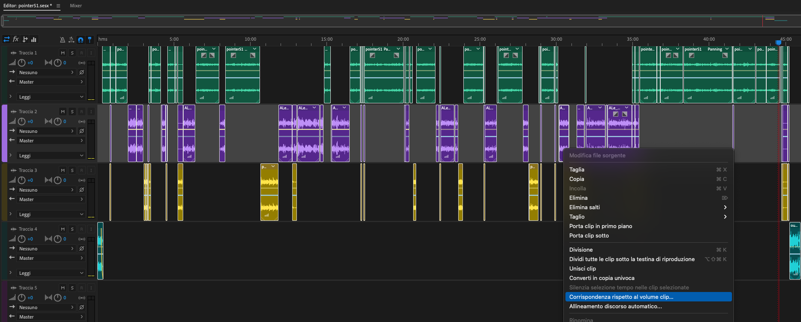
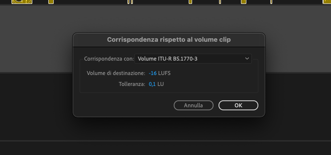

# PointerPodcast

# Montaggio di un episodio

Per il montaggio di un episodio solitamente utilizziamo Adobe Audition, a differenza delle prime puntate abbiamo una traccia per ogni persona che parla durante la puntata e le assembliamo insieme.

## Quali effetti utilizziamo?

#### Sincronizzazione del volume delle tracce 

- Per avere un volume simile in tutte le tracce che inseriamo nel progetto, selezionare tutte le tracce (comprese quelle con intro ed outro).
- Una volta selezionate le tracce clicchiamo su una delle tracce con il tasto destro e poi su "Corrispondenza rispetto al volume clip"


- Comparirà un popup, il volume di destinazione deve essere impostato su "16", fate click su "Ok"



# Come pubblicare un nuovo episodio

- Creare una nuova cartella chiamandola con il numero della puntata in /content/post
- Creare all'interno della cartella un file "index.md"
- La struttura del file deve essere la seguente, cambiare i vari campi in base alla puntata:

```
---
title: "TITOLO PUNTATA"
description:
date: 2021-05-05
categories:
  - Podcast

episode: 50
podcast: records/pointer50.mp3
type: episode
---

Descrizione della puntata

## Note della puntata

Link vari

Ascolta la puntata su [Apple Podcast](https://podcasts.apple.com/it/podcast/pointerpodcast/id1465505870) o [Spotify](https://open.spotify.com/show/3XmDzcZv4rCIx1VpWrbrkh).

I nostri contatti:

- [Instagram](https://www.instagram.com/pointerpodcast/)
- [Facebook](https://www.facebook.com/pointerPodcast/)
- [Twitter](https://twitter.com/PointerPodcast)
- [Mail](info@pointerpodcast.it)
- [Canale Telegram](https://t.me/PointerPodcast)
- [Twitch](https://www.twitch.tv/pointerpodcast)

```

## Come creare un nuovo ospite

- L'immagine dell'ospite va inserita all'interno della cartella /static/guest_images.
- Il nome dell'immagine che inseriamo deve essere nel formato "nome_cognome.jpg"
- In /content/page/guests creare una nuova cartella chiamandola con il nome dell'ospite, il formato deve essere "nomecognome"
- All'interno della cartella creare un file chiamato "nomecognome.md". 
- Il contenuto del file deve essere il seguente:

```
---
title: Nome Cognome
type: guests
# URL
slug: guests/nomecognome
linkedin: 
github: 
site: 
layout: "guestPage"
image: nome_cognome.jpg
bio: ""
episodes: 
    "Episodio 1"
    "Episodio 2"
---
```
- Recarsi nella cartella /data/guests/ e creare un file relativo all'ospite con nome "nomecognome.json".
- All'interno del file "nomecognome.json" inserire i seguenti dati:

```
{
    "Name": "Nome Cognome",
    "Description": "",
    "url": "nomecognome",
    "img": "nome_cognome.jpg"
}
```

## Come aggiungere l'elenco degli ospiti all'episodio

Se un episodio ha un ospite basterà modificare il post index.md aggiundo la voce "guests" sotto a "type", il formato è il seguente:

```
guests: [{"nomecognome": "nome_cognome.jpg"},
        {"pippopaperino": "pippo_paperino.jpg"},
        {"billgates": "bill_gates.jpg"}]
```

Notare che il "nomecognome" e "nome_cognome.jpg" sono gli stessi che abbiamo definito in precedenza quando abbiamo creato l'ospite.

## Come caricare il file .mp3 della puntata

- Il file .mp3 della puntata va inserito nella cartella /static/records.
- Prima (o dopo) aver fatto il push su github e aver pubblicato il nuovo episodio eseguite lo script "./sync.sh" che non è su Github.
